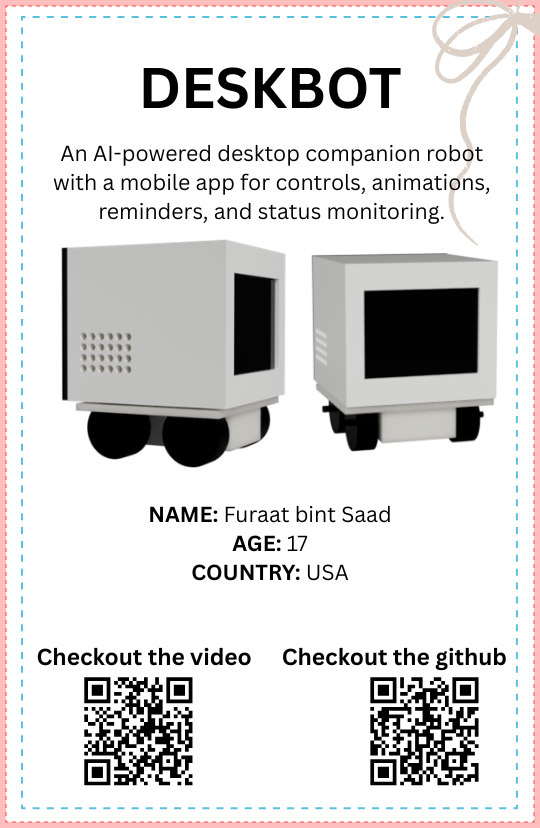

# DESKBOT - Desktop comapnion
* An AI-powered desktop companion robot with a mobile app for controls, animations, reminders, and status monitoring.
This is a hardware project but it also has a website as a control dashboard.*
> Built by Furaat for [Stardance](https://stardance.hackclub.com/home)

--------------------------------------------------------------
## Features:
    1. Weather
    2. Time & date/day
    3. Alarms & reminders
    4. Animated expressions
    5. AI voiceover, Voice commands
    6. Study timer
    7. Website/App control
    8. Head, arm movements
    9. Mechanical whirring sounds
## Tech specs
ESP32 C3 Super Mini - N20 Gear Motors - 503450 LiPo - 28mm Speaker - TB6612FNG - TP4056 with Protection - 1.9" IPS TFT Display
---------------------------------------------------------------
## 3D Build
This can be printed in PLA

Back panel opened

----------------------------------------------------------------
## Check it out!
[CAD demo](https://youtu.be/cJGLPrF72oA)
---------------------------------------------------------------- 

